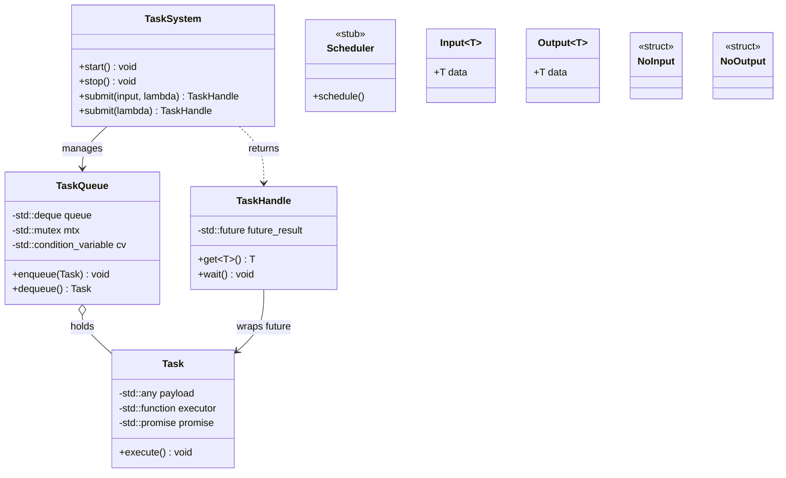
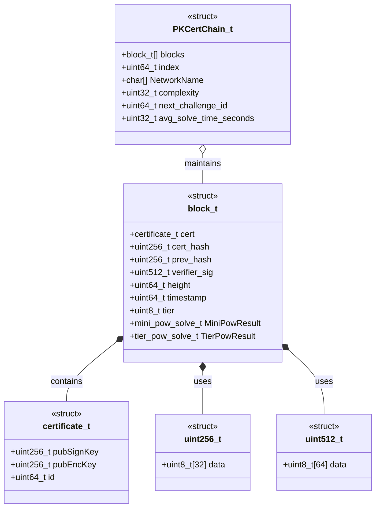
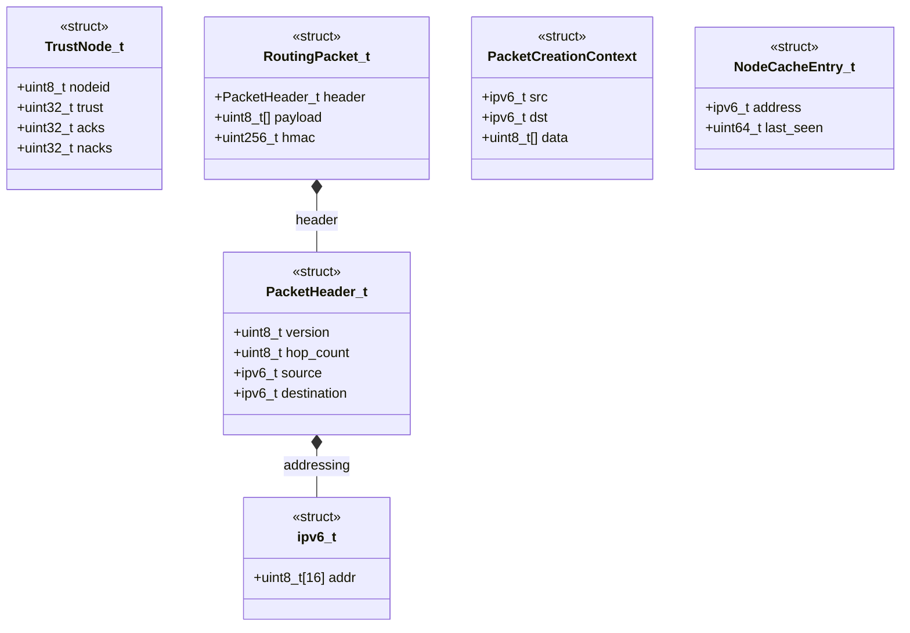
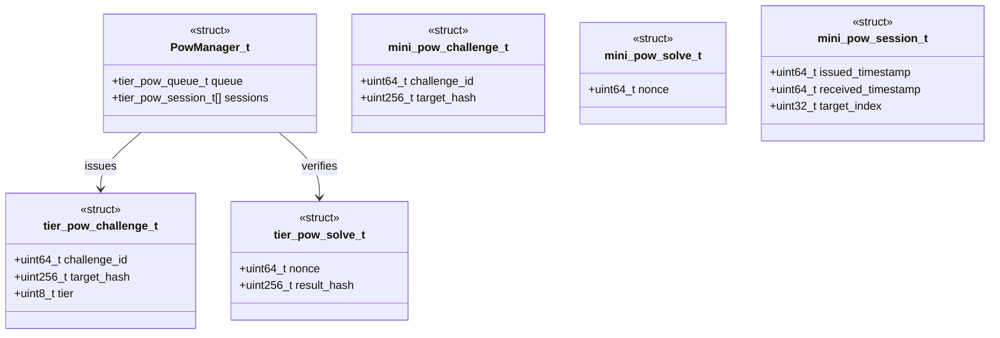

# DATAEXSYS-P2P Class Diagrams

This document contains Mermaid class diagrams mapping out the key structures and classes within the `shared` and `nodeEngine` directories.

## 1. nodeEngine: Task Runtime System

The `nodeEngine` folder primarily implements a multithreaded task execution runtime based on type-erased payloads.

---

## 2. Shared: Blockchain & Cryptography (`peer/shared/inc/protocol/blockchain` & `crypto`)

These structures define the identity chain and block verification data.

---

## 3. Shared: Trust & Networking (`peer/shared/inc/protocol`)

These definitions represent the P2P networking layer and local trust ledger tracking.

---

## 4. Shared: Proof-of-Work (Tier & Mini)

Structures mapping out the mathematical gating and validation components.

